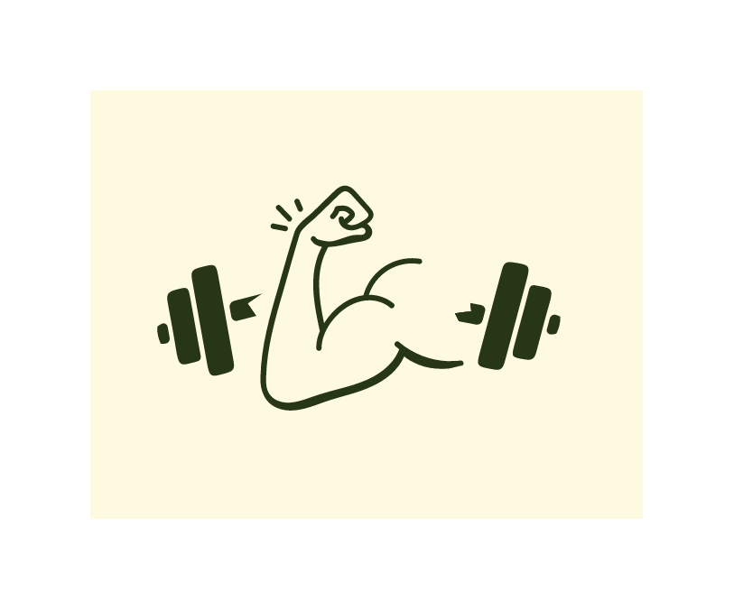

# pump-you-up

 
  

# Overview
*__It\'s time to Pump-U-Up!__* Are you ready to make the change from *__wimp__* to *__stud__*? Start tracking your weight training workouts in this app and watch your progress. Create an account and choose the muscle group category to log each workout. Add the exercise name, amount of weight used, number of reps, and number of sets. Come back and login every day to watch those numbers climb as your muscles get jacked. 

 

**********

## Pump-U-Up Demo

 
 
 

**********

## Technologies used in this app:
* React (https://reactjs.org/) Version 18.2.0
* React-Router-Dom (https://www.npmjs.com/package/react-router-dom) Version 6.8.1
* Express Version (https://expressjs.com/) 4.18.2
* Sequelize Version (https://sequelize.org/) 6.28.0
* Node-Postgres (https://www.npmjs.com/package/pg) Version 8.9.0
* Deployed using AWS 

## Collaborators:
* Benjamin Farmer
* Aisha Rincon
* Jennifer Stephens

## Deployed site: